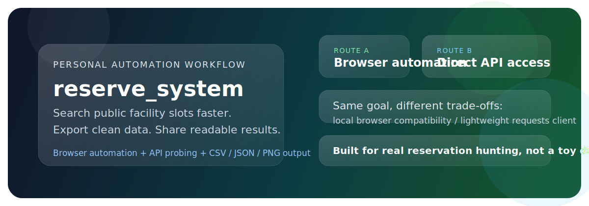
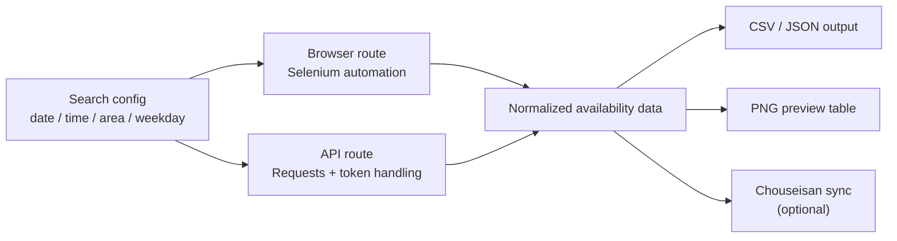

# reserve_system

<p align="center">
  
</p>

<p align="center">
  一个围绕横滨市公共设施预约查询打造的个人自动化工具箱。<br />
  把重复、碎片化、容易漏看的检索流程，整理成可复用的本地工作流。
</p>

<p align="center">
  <a href="https://github.com/hakupao/reserve_system"></a>
  <a href="requirements.txt"></a>
  <a href="browser_version/README.md"></a>
  <a href="api_version/README.md"></a>
  <a href="https://github.com/hakupao/reserve_system/commits/master"></a>
</p>

## 项目概览

横滨市公共设施预约站点本身并不难用，但当需求变成“反复按日期、时间、区域、星期筛空位，再把结果整理给自己或队友”时，手动操作很快就会变成机械劳动。

这个项目的核心想法不是再做一个花哨的管理后台，而是把这条重复路径拆成三层：

- 数据获取：分别提供浏览器自动化和直接 API 调用两条路线
- 结果整理：统一落盘为 CSV / JSON，并生成可读性更高的结果图
- 外部同步：在浏览器版本里把结果继续同步到 `调整さん`，服务实际活动组织

默认场景明显偏向羽毛球场地检索，但代码结构已经把搜索、解析、输出、同步拆开，便于继续往别的设施类型扩展。



## 项目预览

下图是浏览器版本自动生成的结果预览图，适合快速看空档，不必先打开 CSV：


## 为什么这个仓库值得公开展示

- 它不是演示性质的小玩具，而是针对真实订场流程做的个人效率工具
- 同一个业务目标，给了两种技术取舍完全不同的实现方式
- 浏览器版本贴近真实用户流程，API 版本则更轻量、易批处理
- 输出层不是“打印到终端就结束”，而是明确考虑了后续共享、归档和再利用
- 从代码结构上能看到作者在往“长期维护的小工具”方向演进，而不是一次性脚本

## 两条实现路线

| 路线 | 适合场景 | 主要能力 | 输出 | 代价 |
| --- | --- | --- | --- | --- |
| `browser_version` | 需要高度还原真实页面操作、生成可视化结果、同步到 `调整さん` | Selenium 自动化、任务化搜索、结果合并、表格图片生成 | `CSV`、`PNG` | 依赖本地浏览器和 ChromeDriver |
| `api_version` | 想更快地批量拉取结果、降低浏览器依赖 | 会话初始化、token 处理、接口请求、错误恢复 | `JSON`、`CSV` | 更依赖对站点内部接口和参数的理解 |

对应文档：

- [浏览器版本说明](browser_version/README.md)
- [API 版本说明](api_version/README.md)
- [开发文档](docs/DEVELOPMENT.md)
- [变更日志](docs/CHANGELOG.md)

## 适用场景

- 想定期查看某些区的羽毛球场地是否有空位
- 不想重复手动点日期、时间段、区域和星期过滤器
- 想把检索结果沉淀成结构化数据，方便后续通知、共享或分析
- 想研究“浏览器自动化”和“站点 API 逆向”在同一业务问题上的不同解法

## 在线体验

这个仓库目前没有提供公网 demo。

原因很直接：项目依赖目标站点的实时数据、会话状态和本地浏览器环境，公开在线演示并不能很好代表实际使用方式。对外展示主要依靠：

- 仓库首页说明
- 结果预览图
- 模块化代码结构
- 样例输出文件

## 快速开始

### 1. 安装依赖

```bash
git clone https://github.com/hakupao/reserve_system.git
cd reserve_system
pip install -r requirements.txt
```

### 2. 配置可选的 `.env`

如果你需要把结果同步到 `调整さん`，先复制环境变量模板：

```bash
cp .env.example .env
```

Windows PowerShell:

```powershell
Copy-Item .env.example .env
```

然后填写：

- `CHOUSEISAN_URL`
- `CHOUSEISAN_EMAIL`
- `CHOUSEISAN_PASSWORD`
- `CHOUSEISAN_HEADLESS`

如果这些值留空，浏览器版本会自动跳过 `调整さん` 同步步骤。

### 3. 选择运行路线

浏览器版本：

```bash
python browser_version/src/main.py
```

API 版本：

```bash
python api_version/main.py
```

## 输出物

浏览器版本会按时间戳生成目录，典型结果包括：

- `工作日.csv`
- `周末和假日.csv`
- `all_results.csv`
- `results_table.png`

API 版本会输出：

- 原始 / 解析后的 `JSON`
- 便于筛选和转发的 `CSV`

## 目录结构

```text
reserve_system/
├── api_version/         # 直接调用站点接口的实现
├── browser_version/     # Selenium 驱动的页面自动化实现
├── docs/                # 开发文档、变更日志、README 资产
├── .env.example         # 调整さん同步的环境变量模板
├── requirements.txt     # 根依赖
└── README.md            # 仓库首页
```

## 当前边界

- 当前搜索流程是围绕横滨市公共设施预约站点定制的，不是通用预约平台框架
- 浏览器版本目前默认勾选的是羽毛球相关选项，扩展到其他用途时需要调整页面操作逻辑
- 公开仓库中不再存放个人账号、密码和活动链接，相关配置改为本地环境变量

如果你关心的不是“做一个通用 SaaS”，而是“把真实、重复、烦人的个人流程自动化”，这个仓库就是一个相对完整的样本。
