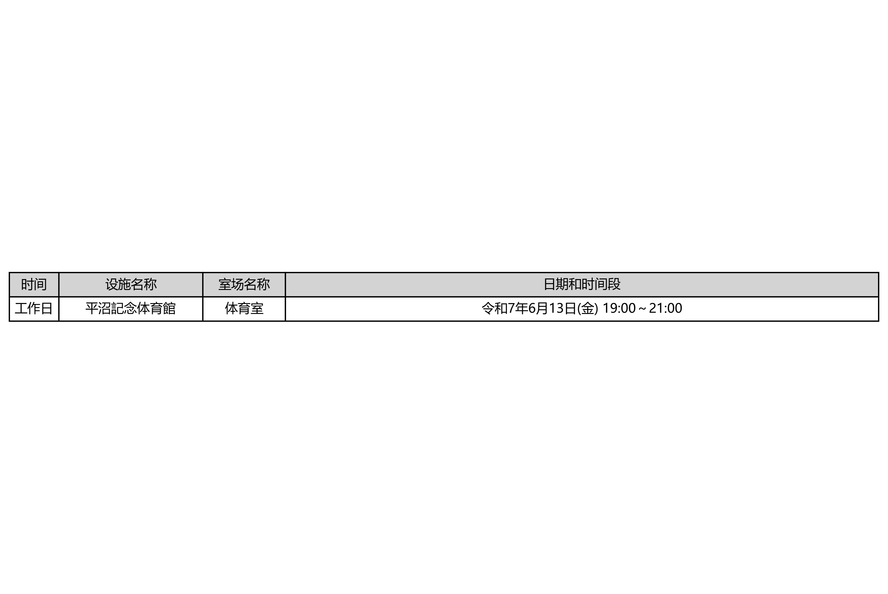

[English](README.md) | [中文](README_CN.md)

<div align="center">


</div>

I'm **Bojiang**, a badminton enthusiast in Yokohama, Japan. When automating facility searches, sometimes you need raw querying power beyond a browser extension. **reserve_system** is my Python utility for batch-checking Yokohama facility availability with two flexible approaches: Selenium browser automation or direct HTTP API calls.

---

## 📋 Overview

**reserve_system** complements **[badminton-yoyaku](../badminton-yoyaku)** browser extension with programmatic facility checking. Check hundreds of time slots in seconds using Python automation.

### Key Features

| Feature | Details |
|---------|---------|
| 🔄 **Batch Processing** | Check multiple facilities, dates, time slots simultaneously |
| 🌐 **Two Query Methods** | Selenium browser automation OR HTTP API direct calls |
| 📊 **CSV Export** | Results exported to spreadsheet for analysis |
| ⚙️ **Configurable** | YAML/JSON config files for flexible scheduling |
| 🔐 **Secure** | `.env.example` for credential management |
| 📝 **Logging** | Comprehensive operation logs for debugging |
| 🐳 **Docker Ready** | Containerized deployment option |

---


### Output Preview

<div align="center">
  
</div>

## 🚀 Tech Stack

<div align="center">


</div>

**Core**: Python 3.11+ with type hints

**Web Automation**: Selenium 4 for browser-based queries

**HTTP Client**: Requests library for direct API calls

**Data Processing**: Pandas for CSV export and analysis

**Configuration**: YAML/JSON for flexible setup

---

## 📦 Project Structure

```
reserve_system/
├── main.py              # Entry point
├── config/
│   ├── facilities.yaml  # Facility definitions
│   └── schedule.yaml    # Query schedules
├── src/
│   ├── selenium_checker.py    # Browser automation
│   ├── api_checker.py         # Direct HTTP queries
│   ├── csv_exporter.py        # Results export
│   └── logger.py              # Logging utilities
├── docs/
│   ├── SETUP.md
│   ├── SELENIUM.md
│   └── API.md
├── results/             # Output CSVs
├── logs/                # Operation logs
├── .env.example         # Template for credentials
├── requirements.txt     # Python dependencies
├── docker-compose.yml   # Container configuration
└── README.md
```

---

## 🛠️ Installation & Setup

### Prerequisites
- Python 3.11+
- pip package manager
- Chrome/Chromium (for Selenium option)
- Docker (optional)

### Local Setup

```bash
# Clone repository
git clone https://github.com/hakupao/reserve_system.git
cd reserve_system

# Create virtual environment
python -m venv venv
source venv/bin/activate  # On Windows: venv\Scripts\activate

# Install dependencies
pip install -r requirements.txt

# Setup environment file
cp .env.example .env
# Edit .env with your credentials if needed
```

### Configuration

Create or edit `config/facilities.yaml`:

```yaml
facilities:
  - name: "Kanagawa Badminton Center"
    id: "kanagawa-001"
    url: "https://facility-booking.yokohama.jp/kanagawa"
    courts:
      - "Court 1"
      - "Court 2"
    
  - name: "Yokohama Sports Center"
    id: "yokohama-sports"
    url: "https://facility-booking.yokohama.jp/sports"
    courts:
      - "Badminton A"
      - "Badminton B"

queries:
  batch_size: 10          # Check 10 at a time
  timeout: 30             # 30 second timeout
  retry_count: 3          # Retry 3 times on failure
```

---

## 🚀 Usage Examples

### Method 1: Selenium Browser Automation

```bash
# Check availability using Selenium
python main.py --method selenium \
  --facility "Kanagawa Badminton Center" \
  --dates 2025-04-04 2025-04-15 \
  --times "18:00-20:00" "20:00-22:00"
```

**Advantages**:
- Handles JavaScript-heavy websites
- Works with modern web apps
- Can handle complex interactions
- Reliable for dynamic content

**Disadvantages**:
- Slower (browser startup overhead)
- Higher resource usage
- Requires Chrome/Chromium

### Method 2: HTTP API Direct Calls

```bash
# Check availability using direct API calls
python main.py --method api \
  --facility "Kanagawa Badminton Center" \
  --dates 2025-04-04 2025-04-15 \
  --times "18:00-20:00" "20:00-22:00"
```

**Advantages**:
- Much faster (no browser overhead)
- Lower resource usage
- Lightweight, scalable
- Suitable for batch jobs

**Disadvantages**:
- Requires API documentation
- May not work if site structure changes
- No JavaScript execution

### Batch Processing

```bash
# Process multiple facilities at once
python main.py \
  --method api \
  --batch-file config/batch_query.yaml \
  --export-csv results/availability.csv
```

---

## 📊 Configuration Files

### facilities.yaml

```yaml
facilities:
  - name: "Facility Name"
    id: "unique-id"
    url: "https://..."
    courts: ["Court 1", "Court 2"]
    max_days_ahead: 30
    holidays: [2025-05-05, 2025-05-06]
```

### schedule.yaml

```yaml
queries:
  target_facilities:
    - "Kanagawa Badminton Center"
    - "Yokohama Sports Center"
  
  date_ranges:
    - start: 2025-04-04
      end: 2025-04-30
  
  time_slots:
    - 18:00-20:00
    - 20:00-22:00
  
  method: "api"  # or "selenium"
  export_format: "csv"
```

---

## 📁 CSV Export Format

Results exported as:

```csv
facility,date,time_slot,court,available,booked_count,checked_at
Kanagawa Badminton Center,2025-04-04,18:00-20:00,Court 1,true,0,2025-04-04T14:30:00Z
Kanagawa Badminton Center,2025-04-04,18:00-20:00,Court 2,false,1,2025-04-04T14:30:00Z
Yokohama Sports Center,2025-04-04,20:00-22:00,Badminton A,true,0,2025-04-04T14:30:01Z
```

---

## 📝 Logging

All operations logged to `logs/` directory:

```
logs/
├── 2025-04-04_selenium_check.log
└── 2025-04-04_api_check.log
```

**Log Entry Example**:
```
[2025-04-04 14:30:00] INFO: Starting API check for Kanagawa Badminton Center
[2025-04-04 14:30:01] INFO: Found 2 available slots on 2025-04-05
[2025-04-04 14:30:01] INFO: Exported results to results/availability.csv
[2025-04-04 14:30:02] INFO: Check completed successfully
```

---

## 🐳 Docker Deployment

### Build Image

```bash
# Build container
docker build -t reserve-system:latest .
```

### Run with Docker Compose

```yaml
# docker-compose.yml
version: '3.9'
services:
  reserve-checker:
    image: reserve-system:latest
    volumes:
      - ./config:/app/config
      - ./results:/app/results
      - ./logs:/app/logs
    environment:
      - METHOD=api
      - LOG_LEVEL=INFO
```

```bash
# Start container
docker-compose up -d

# View logs
docker-compose logs -f reserve-checker

# Stop container
docker-compose down
```

---

## 🔐 Environment & Credentials

### .env File

```env
# Yokohama Facility Login (if needed)
FACILITY_USERNAME=your_username
FACILITY_PASSWORD=your_password

# Proxy settings (optional)
HTTP_PROXY=http://proxy.example.com:8080
HTTPS_PROXY=http://proxy.example.com:8080

# Logging
LOG_LEVEL=INFO
LOG_DIR=./logs

# Performance
MAX_RETRIES=3
TIMEOUT_SECONDS=30
BATCH_SIZE=10
```

---

## 📊 API Mode Implementation

For sites with public APIs, directly call endpoints:

```python
import requests

def check_availability_api(facility_id: str, date: str, time_slot: str) -> dict:
    """Query facility availability via HTTP API"""
    url = f"https://api.yokohama-facilities.jp/availability"
    params = {
        "facility_id": facility_id,
        "date": date,
        "time_slot": time_slot
    }
    
    response = requests.get(url, params=params, timeout=30)
    response.raise_for_status()
    
    return response.json()
```

---

## 🔄 Selenium Mode Implementation

For JavaScript-heavy sites, use Selenium:

```python
from selenium import webdriver
from selenium.webdriver.common.by import By

def check_availability_selenium(facility_url: str, date: str) -> dict:
    """Query facility availability via browser automation"""
    driver = webdriver.Chrome()
    
    try:
        driver.get(facility_url)
        
        # Fill date selector
        date_input = driver.find_element(By.ID, "date-picker")
        date_input.send_keys(date)
        
        # Click search
        search_btn = driver.find_element(By.ID, "search-btn")
        search_btn.click()
        
        # Extract availability
        # ... parsing logic ...
        
        return availability_data
    finally:
        driver.quit()
```

---

## 📖 Related Projects

- **[badminton-yoyaku](../badminton-yoyaku)** - Browser extension for real-time monitoring
- **[badminton-tournament-v2](../badminton-tournament-v2)** - Tournament management system
- **[shuttle-path](../shuttle-path)** - Coaching knowledge platform
- **[badminton_tournament_tool](../badminton_tournament_tool)** - Tournament tool v1

---

## 🧪 Testing

```bash
# Run tests
python -m pytest tests/

# With coverage
python -m pytest --cov=src tests/

# Run specific test
python -m pytest tests/test_api_checker.py -v
```

---

## 📝 Changelog

### v1.2.0 (Current)
- Dual query methods (Selenium + API)
- CSV export functionality
- Docker Compose support
- Enhanced logging

### v1.1.0
- Configuration file support
- Batch processing
- Error retry logic

### v1.0.0
- Initial release with Selenium support
- Basic facility checking
- Log output

---

## 🤝 Contributing

Contributions welcome! Areas:

1. **Additional Facilities**: Add more Yokohama facilities
2. **API Integrations**: Direct API support for more sites
3. **Export Formats**: JSON, Excel, database export
4. **Notifications**: Email, Slack alerts for availability
5. **Scheduling**: Cron integration for regular checks

---

## 📄 License

MIT License - See [LICENSE](LICENSE) file

---

## 💬 Contact & Support

- **GitHub**: [@hakupao](https://github.com/hakupao)
- **Issues**: [GitHub Issues](https://github.com/hakupao/reserve_system/issues)
- **Documentation**: [docs/](docs/) directory

---

<div align="center">

**Batch-check facilities, find your court fast**


</div>
